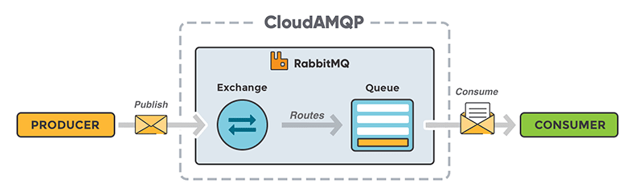
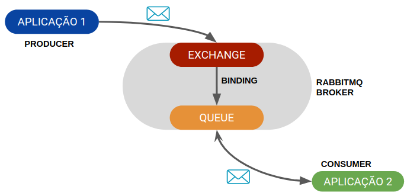
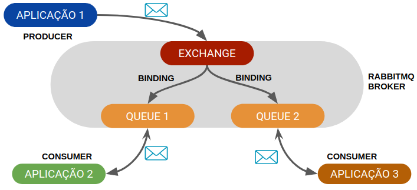
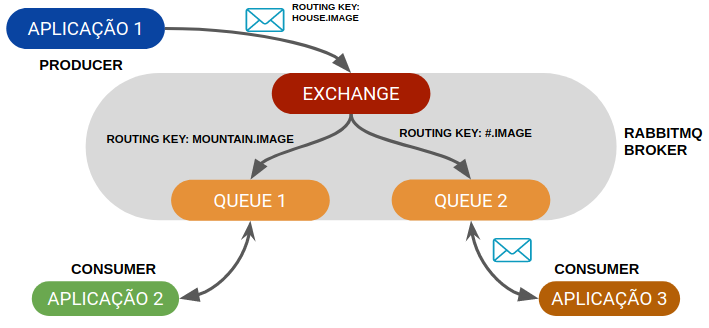

# Tutorial RabbitMQ

Tutorial de utilização do RabbitMQ.

## Conceitos

### Message Broker

Os message brokers são uma tecnologia de comunicação entre aplicativos que ajuda a criar um mecanismo de integração comum para suportar arquiteturas de cloud híbrida, sem servidor e com base em microsserviços.

| <https://www.ibm.com/br-pt/cloud/learn/message-brokers>

### RabbitMQ

É um message broker.

### Como funciona

Uma aplicação publica uma mensagem para o Rabbit. Essa mensagem então é enviada para uma exchange, que é um artefato de roteamento, fazendo uma analogia, como um carteiro responsável por fazer a entrega). As exchanges, cada qual de acordo com sua configuração, direcionam a mensagem para uma ou mais filas. Na outra ponta, existe um (ou mais) consumidor(es) responsável por escutar a fila e consumir a mensagem (mais sobre isso abaixo).

É importante dizer que se uma mensagem chegar numa fila com 3 consumidores conectados, apenas um deles receberá a mensagem para processamento (entrega única). Caso seja necessário que mais de um consumidor receba a mesma mensagem, , a exchange para qual a mensagem é enviada deve ser configurada para rotear essa mensagem para várias filas. Assim, a mensagem é replicada e entregue para n filas, permitindo consumidores independentes de uma mesma mensagem - spoiler do que vamos falar mais à frente. Aqui embaixo uma imagem do CloudAMQP para ilustrar:

| <https://dev.to/mviegas/pt-br-introducao-ao-rabbitmq-com-net-core-15oc>

### Exchange

Exchange é um artefato de roteamento que funciona como um carteiro responsável por entregar as mensagens. Quando uma mensagem é publicada numa exchange, é enviada uma propriedade (setada por quem envia) chamada routing key. Essa key funciona como o endereço do destinatário. A exchange olha a key e sabe para onde entregar.

* Direct: a mensagem é enviada para uma fila com o mesmo nome da routing key. Se a routing key não for informada, ela é enviada para uma fila padrão.

* Fanout: a mensagem é distribuída para todas as filas associadas. Esse tipo de exchange ignora a routing key.

* Topic: a mensagem é distribuída de acordo com um padrão enviado pela routing key.

* Header: a mensagem é distribuída de acordo com seus cabeçalhos. Dessa forma, é feito um match com qual consumidor deve receber aquela mensagem.

### Queues (filas)

Recebem as mensagens da exchange e armazenam até que um consumidor se conecte para retirar as mensagens de lá. O nome sugere, isso é feito seguindo uma lógica FIFO (first-in, first-out). Podem ter os seguintes atributos:

* Durable: a fila sobrevive ao restart do message broker. O RabbitMQ possui um banco de dados chamado Mnesia aonde armazena essas informações.
* Exclusive: possui somente 1 consumidor e morre quando não há mais consumidores.
* Autodelete: morre quando não há mais mensagens.

### Binds (associações)

Para que uma exchange entregue uma mensagem para uma fila, deve haver uma associação, um bind entre elas. Isso pode ser feito de maneira programática por quem envia ou através de uma interface web que o RabbitMQ disponibiliza para gerenciamento do broker.

## Aviso

Este repositório está sob a licença MIT. Contato: Lyndon Tavares (integraldominio@gmail.com)
