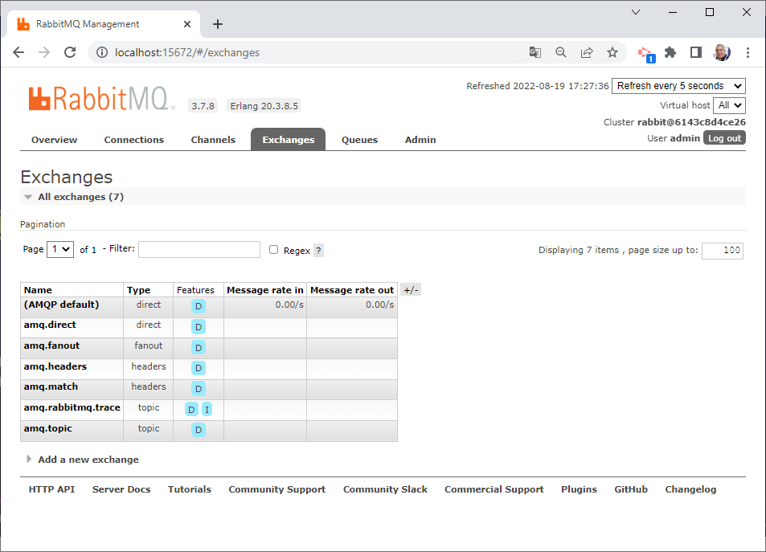

# Projeto 1

Este projeto mostra configuração mínima para o rabbitMQ. Trata-se um app que expôe uma APi Rest para teste do envio de uma mensagem.
O exchange será o default (tipo:direct) e a fila será criada com nome 'order'.

São pré-requisitos:

* Docker
* Client Rest

## Docker

```shell
docker-compose up -d
```

## Run

```shell
mvn spring-boot:run
```

Configuração do rabbitmq com o sprintboot:

## Applicatioin.yml

```yml
spring:
  rabbitmq:
    host: localhost
    port: 5672
    username: admin
    password: 123456
```

## Admin RabbitMQ

A adminstração do RabbitMQ é feita pela url: http://localhost:5672, usando usuário e senha conforme configuração abaixo.



## RabbitMQConfig.java

```java

// Responsável por criar a fila
@Bean
public Queue queue() {
   return new Queue("order");
}

// Instância do rabbitMQ
@Bean
public RabbitAdmin rabbitAdmin(ConnectionFactory connection) {
   return new RabbitAdmin(connection);
}

// Estabelece conexão e cria fila
@Bean
public ApplicationListener<ApplicationReadyEvent> applicationListener(RabbitAdmin rabbittAdmin) {
   return event -> rabbittAdmin.initialize();
}

// Mapper de serialização
@Bean
public Jackson2JsonMessageConverter messageConverter() {
   return new Jackson2JsonMessageConverter();
}

@Bean
public RabbitTemplate rabbitTemplate(ConnectionFactory connectionFactory,
                                     Jackson2JsonMessageConverter messageConverter) {
    RabbitTemplate rabbitTemplate = new RabbitTemplate(connectionFactory);
    rabbitTemplate.setMessageConverter(messageConverter);
    return rabbitTemplate;
}
```
