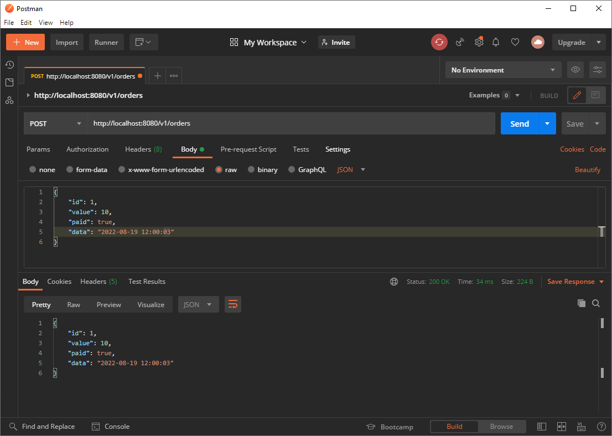

# Projeto 2

Nsste projeto mosta a cinfiguração de envio e recebimento de mensagems. Utilizaremos o projeto 1 como base.

## Configuração

```java

	// Criar fila
	@Bean
	public Queue queue() {
		...
	}

	// Instância do rabbitMQ
	@Bean
	public RabbitAdmin rabbitAdmin(ConnectionFactory connection) {
	   ...
	}

	// Inicializa rabbit
	@Bean
	public ApplicationListener<ApplicationReadyEvent> applicationListener(RabbitAdmin rabbittAdmin) {
		...
	}

	// Mapper serializção/deserialização
	@Bean
	public Jackson2JsonMessageConverter messageConverter() {
		...
	}

	// Manipular filas
	@Bean
	public RabbitTemplate rabbitTemplate(ConnectionFactory connectionFactory,
			Jackson2JsonMessageConverter messageConverter) {
      ...
	}
```

## Teste

### Postman



### Curl

```bash
curl --location --request POST 'http://localhost:8080/v1/orders' \
--header 'Content-Type: application/json' \
--data-raw '{
    "id": 1,
    "value": 10,
    "paid": true,
    "data": "2022-08-19 12:00:03"
}'
```
